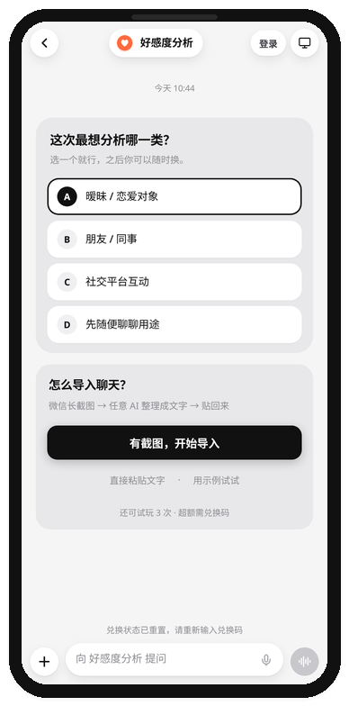
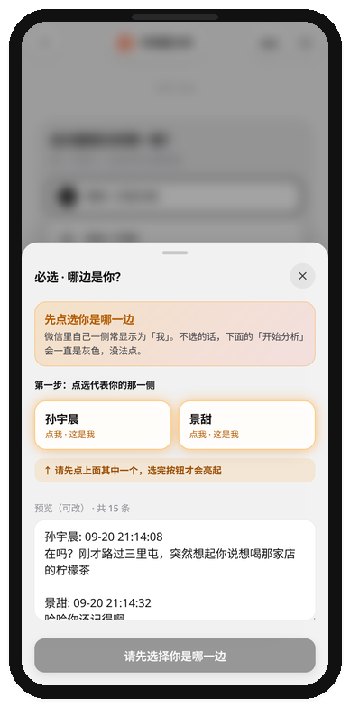
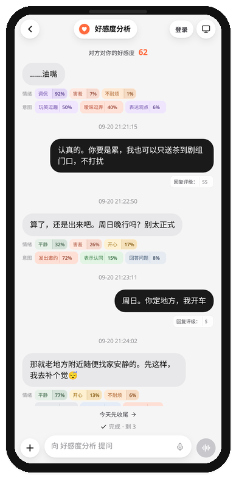

# Affinity Analysis (好感度分析)

<p align="center">
  
</p>

<p align="center">
  <b>Turn chat history into readable relationship signals</b><br/>
  Import WeChat chats · pick a relation type · estimate how they feel about you
</p>

<p align="center">
  
  
  
  <a href="README.md"></a>
</p>

---

## Overview

**Affinity Analysis** helps you read a two-person chat. Paste the transcript, choose a relation context (crush, friend/colleague, social interaction, …), and get a structured read: signals of how the other person may feel about you, emotion/intent tags, and a chat-style UI for follow-up questions.

Treat the output as a reference, not a verdict. The model cannot see offline context.

---

## Screenshots

<p align="center">
  
  &nbsp;&nbsp;
  
  &nbsp;&nbsp;
  
</p>

<p align="center">
  <sub>Home　　·　　Import　　·　　Demo analysis (Sun Yuchen × Jing Tian)</sub>
</p>

---

## Features

- **Chat-first UI** — relation picks, import tips, and results live in a WeChat-like bubble flow.
- **Relation contexts** — crush / friends / social; scoring guidance shifts with the scene.
- **Affinity read** — focuses on *their* favorability toward you, plus colorful emotion/intent tags.
- **Flexible import** — long screenshots refined by any AI into text, direct paste, or one-tap demo.
- **Trial + redeem** — per-device trial quota; redeem codes unlock more. Login alone does not unlock analysis.
- **Admin console** — review synced analyses and manage redeem codes.

---

## Quick start

Requires **Node.js 22.12+**.

```bash
git clone https://github.com/zhengge6/crush-monitor-app.git
cd crush-monitor-app
npm ci
cp .env.example .env
# set JEV_API_KEY in .env
npm run build
npm start
```

Open `http://127.0.0.1:3178/`.

Dev mode: `npm run dev`.

---

## Configuration

| Variable | Purpose |
| --- | --- |
| `JEV_PROVIDER` | `typesafe` / `vercel` / `openrouter` |
| `JEV_API_KEY` | Server-only API key |
| `PORT` / `HOST` | Default `3178` / `0.0.0.0` |
| `AUTH_ENABLED` | Account system |
| `TRIAL_LIMIT` | Per-device trial runs |
| `REDEEM_ENABLED` | Redeem gate |
| `ADMIN_USERNAME` / `ADMIN_PASSWORD` | Admin console |
| `CRUSH_DATA_DIR` | Data directory |

Never commit real `.env`, redeem stores, or user chats.

---

## Stack

React 19 · TypeScript · Vite · Express 5 · Zod · Jev · local JSON storage · systemd (`deploy/`).

```text
src/          frontend
server/       API (analyze, auth, redeem, sync, admin)
shared/       shared types & scoring
docs/assets/  logo & screenshots
deploy/       install + unit file
```

---

## Notes

- Model output is inference, not psychology and not proof of someone’s feelings.
- Chat text is sent to your configured provider; usage bills your key.
- Trial / synced records may live on the server for admin review.
- Evolved from the open-source Crush Monitor line into this product-shaped affinity analyzer.

## License

[MIT](LICENSE)

[简体中文](README.md) · English
