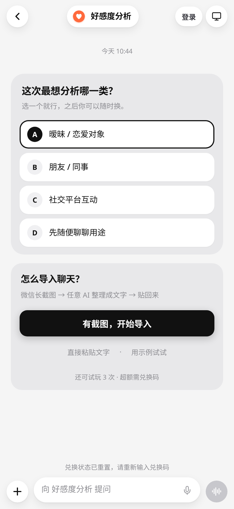
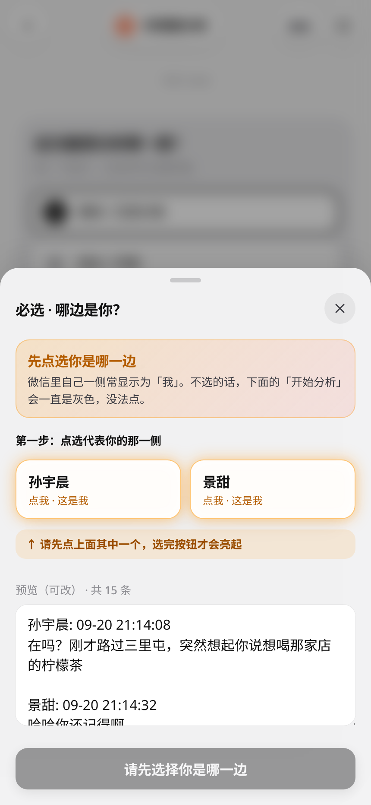
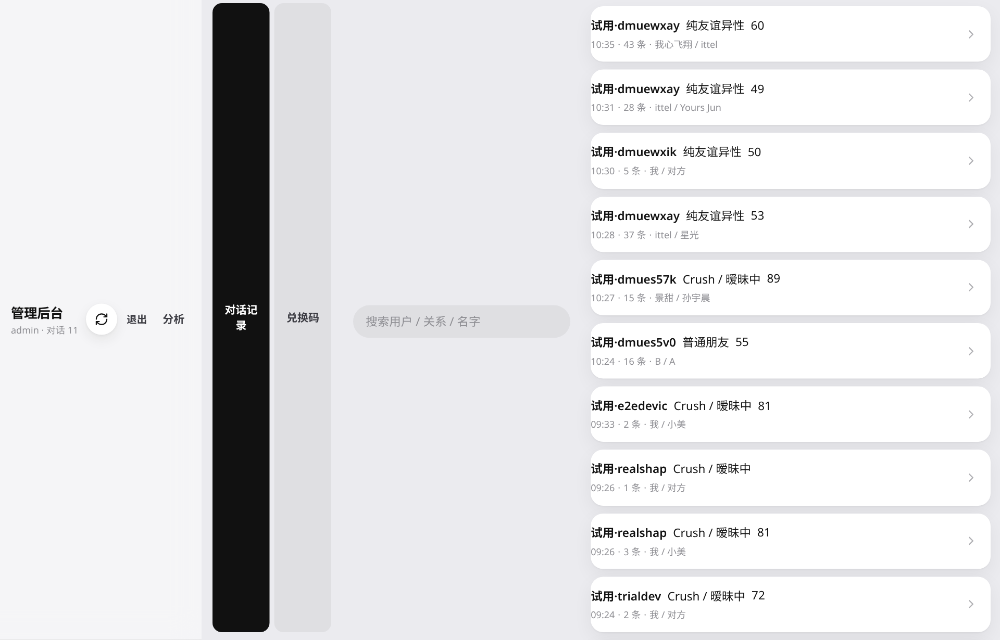

# 好感度分析

<p align="center">
  
</p>

<p align="center">
  <b>把聊天记录变成可读的关系信号</b><br/>
  导入微信聊天 · 识别关系类型 · 估计对方对你的好感度 · 管理后台可回看分析
</p>

<p align="center">
  <a href="http://118.190.99.36:3178/"></a>
  
  
  
  <a href="README.en.md"></a>
</p>

---

## 这是什么

**好感度分析**是一款面向两人聊天的关系辅助工具。你导入聊天文本后，它会按选定的关系类型（暧昧 / 朋友同事 / 社交互动等）给出结构化解读：对方对你的好感信号、情绪与意图标签，以及可继续追问的对话式界面。

它适合做参考，不适合替你做判断。模型看不到线下相处，也读不懂聊天之外的故事。

**在线 Demo：** [http://118.190.99.36:3178/](http://118.190.99.36:3178/)

---

## 产品截图

| 首页与关系选择 | 导入与身份确认 | 管理后台 |
| :---: | :---: | :---: |
|  |  |  |

---

## 核心能力

- **微信式交互**  
  关系选择、导入引导、分析结果都放在聊天气泡流里，降低「分析工具」的压迫感。

- **关系场景**  
  支持暧昧 / 恋爱、朋友 / 同事、社交平台互动等场景；评分口径会随关系切换。

- **好感度解读**  
  关注「对方对你的好感度」，并附带情绪、意图等彩色标签，方便快速扫读。

- **灵活导入**  
  支持长截图经任意 AI 整理成文字后粘贴，也支持直接粘贴聊天文本或一键示例。

- **试用与兑换**  
  设备级试玩次数；超额可用兑换码解锁。登录用于账号能力，不单独解锁分析次数。

- **管理后台**  
  管理员可查看同步上来的对话分析、管理兑换码，便于运营与质检。

---

## 快速开始

需要 **Node.js 22.12+**。

```bash
git clone https://github.com/zhengge6/crush-monitor-app.git
cd crush-monitor-app
npm ci
cp .env.example .env
# 编辑 .env，至少填写 JEV_API_KEY（或对应平台 Key）
npm run build
npm start
```

浏览器打开 `http://127.0.0.1:3178/`。

开发模式：

```bash
npm run dev
```

---

## 环境变量

复制 `.env.example` 为 `.env`。常用项：

| 变量 | 说明 |
| --- | --- |
| `JEV_PROVIDER` | `typesafe` / `vercel` / `openrouter` |
| `JEV_API_KEY` | 对应平台的 API Key（仅服务端，勿写入前端） |
| `PORT` / `HOST` | 默认 `3178` / `0.0.0.0` |
| `AUTH_ENABLED` | 是否启用账号体系 |
| `TRIAL_LIMIT` | 每设备试玩次数 |
| `REDEEM_ENABLED` | 是否启用兑换门槛 |
| `ADMIN_USERNAME` / `ADMIN_PASSWORD` | 管理后台账号 |
| `CRUSH_DATA_DIR` | 数据目录（生产建议独立路径） |

不要把真实 `.env`、兑换码库或用户对话提交进 Git。

---

## 使用流程

1. 选择本次要分析的关系类型。  
2. 用「有截图，开始导入」或「直接粘贴文字」导入聊天。  
3. 在「哪边是你」里确认自己是哪一侧（未选时无法开始分析）。  
4. 查看好感度与标签；需要时继续在输入框追问。  
5. 试玩用尽后，按提示输入兑换码。

管理后台：`/admin`（默认账号见你的 `.env`）。

---

## 技术栈

| 层 | 技术 |
| --- | --- |
| 前端 | React 19 · TypeScript · Vite |
| 后端 | Express 5 · Zod |
| 模型 | Jev（TypeSafe / Vercel AI Gateway / OpenRouter） |
| 数据 | 本地 JSON 存储（对话同步、兑换、试用） |
| 部署 | systemd（见 `deploy/`） |

```text
src/          前端（聊天 UI、登录、分析状态）
server/       API（分析、鉴权、兑换、对话同步、管理端）
shared/       共享类型与评分规则
docs/assets/  README 截图
deploy/       安装与服务单元
```

---

## 部署提示

仓库内提供 `deploy/install.sh` 与 `deploy/crush-monitor.service`。生产环境请：

1. 单独保管 `.env` 与 `data/`，部署时不要覆盖。  
2. 反向代理到 `3178`，按需开启 HTTPS。  
3. 部署后用强密码轮换 `ADMIN_PASSWORD`，并检查兑换码策略。

---

## 说明与边界

- 分析结果是模型推断，不是心理测量，更不是对方真实心意的证明。  
- 聊天原文会发往你配置的模型服务商；用量由你的 Key 承担。  
- 试玩与同步记录可能落在服务端，便于管理查看；请勿导入高度敏感内容到公共 Demo。  
- 本项目基于开源 Crush Monitor 能力演进，面向「好感度分析」产品形态做了 UI、门禁与后台扩展。

---

## License

[MIT](LICENSE)

简体中文 · [English](README.en.md)
